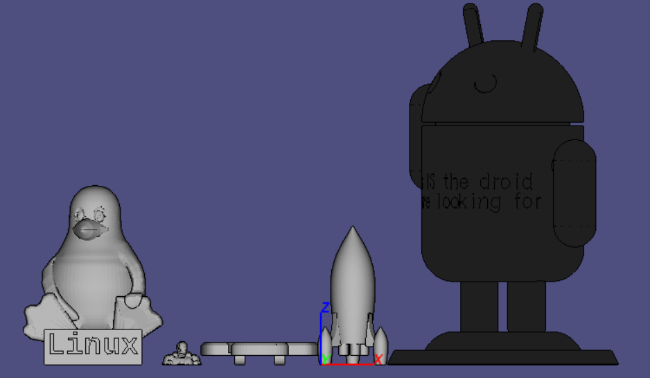
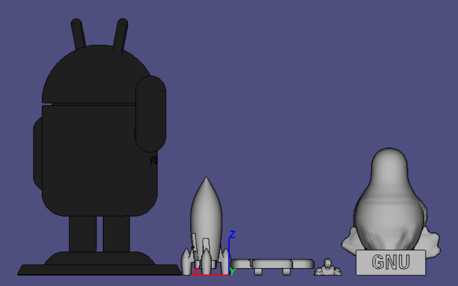
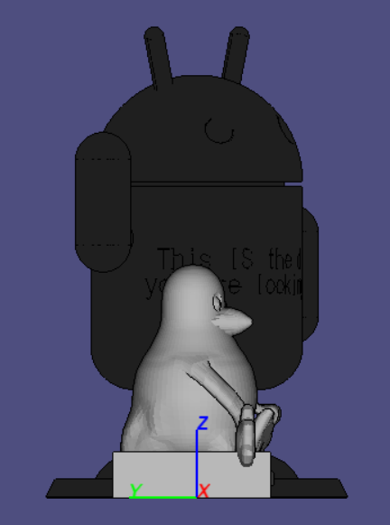
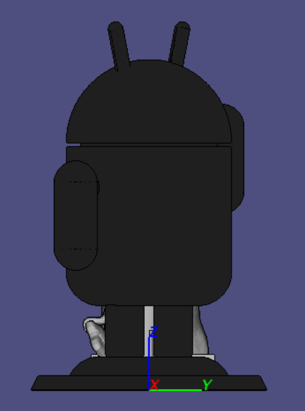
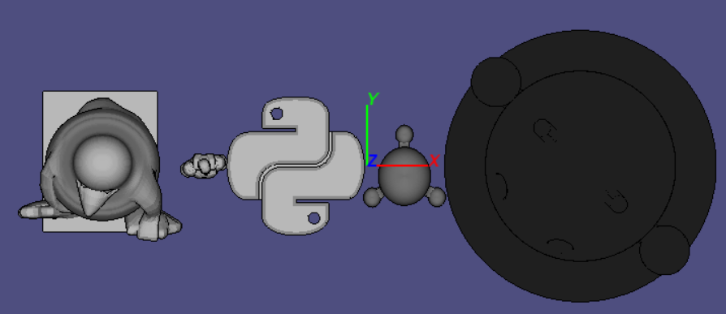
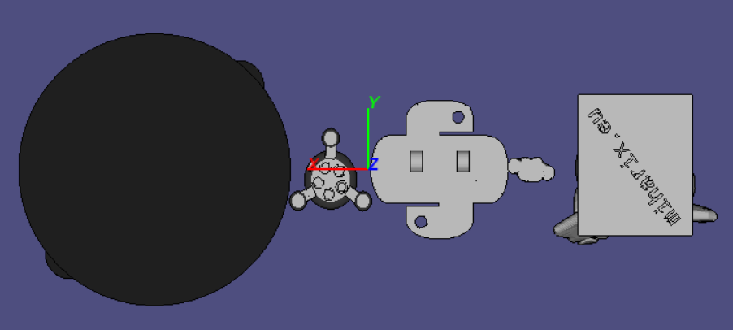
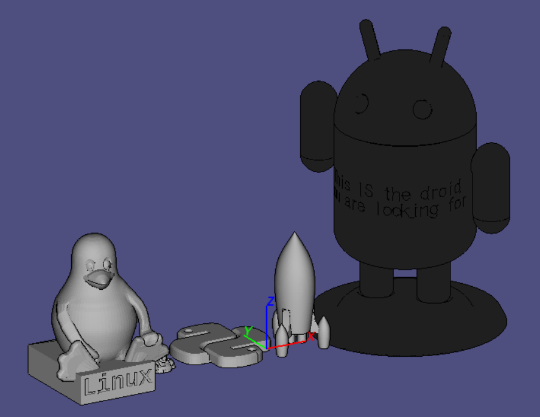
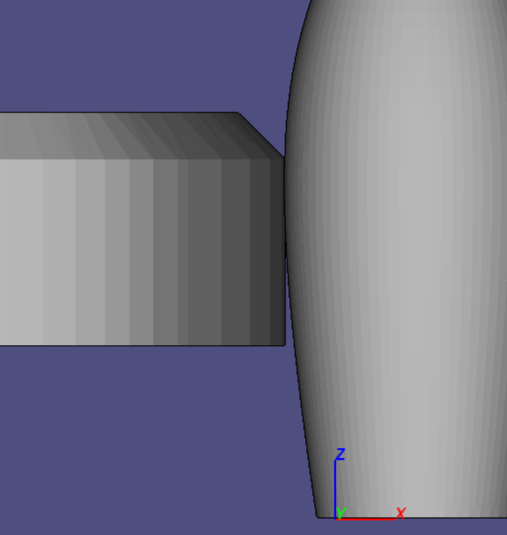

# STL Dosya Birleştirici
C++ dili ile yazıldı. Programın herhangi bir dış kütüphane bağımlılığı yoktur. Standart C++ kütüphaneleri kullanılarak yapılmıştır.

Programa parametre olarak verilen STL formatlı dosyaları birleştirerek tek bir STL dosyası haline getirir. STL dosyalarından okunan şekiller, birbirlerine temas etmeyecek şekilde sıralanarak birleştirilir.


## Derleme

Derlemek için [g++](https://gcc.gnu.org/) gereklidir.
```bash
$ g++ main.cpp src/* -o 3dCombiner
```


## Kullanım
En az 3 parametre ile kullanılabilir. İlk iki parametre birleştirilecek olan dosya konumları ve son parametre birleştirilmiş dosyanın kaydedileceği konum olacaktır.
```bash
$ ./3dCombiner <kaynak 1.stl> <kaynak 2.stl> ... <kaynak n.stl> <hedef.stl>
```
Eğer dosya çalıştırılamıyorsa çalıştırma izni verilmelidir.
```bash
$ chmod +x 3dCombiner
```


## Nasıl?
Program, okunan STL formatındaki dosyaları birer obje haline getiriyor. Okunan her bir objenin dış sınırları belirleniyor. Sınırları belirlenen objelerin merkez noktaları hesaplanarak X ve Y eksenlerinde ortalanıyor, Z ekseni üzerine yerleştiriyor.

Yeni eklenen objeler +X ekseni yönünde ekleniyor. Yeni bir obje ekleneceği zaman önceki objenin dış sınır noktalarına göre yeni objenin konumu belirleniyor. Yeni obje konumlandırıldıktan sonra ikinci objenin bütün noktaları (vertex) ilk objenin noktalarının tutulduğu listeye ekleniyor. 

Ekleme işlemi sonrasında yeni sınır noktalar belirleniyor ve X ve Y eksenlerinde ortalanıyor. Bu işlem sonrasında üçüncü bir obje eklenmeye hazır. 

## Görseller
### Ön

### Arka

### Sol

### Sağ

### Üst

### Alt

### Sol Ön Üst

### Birleşim noktası
